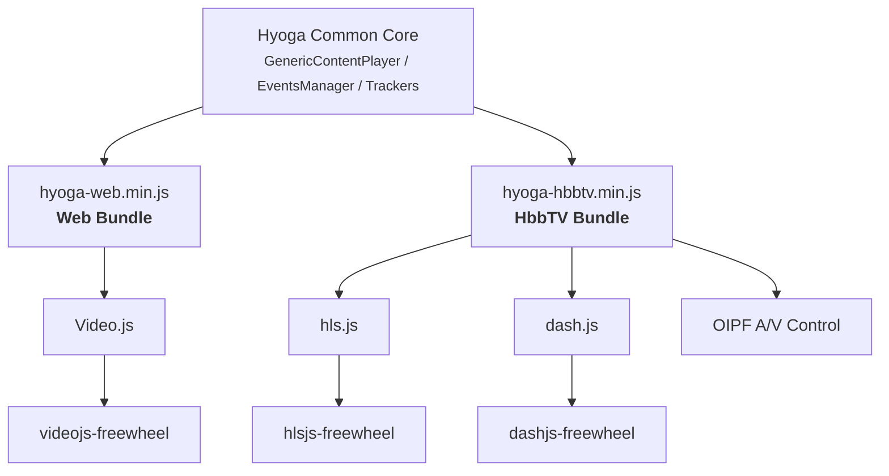

# Adding an A/V Control Player Core

This guide explains how to implement a new `GenericContentPlayer` subclass that uses the **HbbTV A/V Control object** (`<object type="video/mp4">` / `<object type="video/mpeg">`)
instead of the HTML5 `<video>` element combined with dash.js or hls.js.

## Architecture Overview



Each "Player Core" extends `GenericContentPlayer` and implements the playback lifecycle by wrapping a specific underlying player technology. 
Your new `AvControlContentPlayer` will wrap the OIPF A/V Control embedded object.


## Step 1 - Create the Player Core File

Create `src/avcontrol/player-core.js`:

```js
import { GenericContentPlayer } from "../common/genericplayer-core";

class AvControlContentPlayer extends GenericContentPlayer {
    constructor(params) {
        super(params);

        /**
         * Reference to the A/V Control <object> element.
         * The element is expected to already exist in the DOM with
         * id === this.playerSelector (same convention as other cores).
         */
        this.avObject = document.getElementById(this.playerSelector);

        this.init = () => {
            if (!this.playbackReady) {
                this.playbackReady = true;
                this.player = this._createPlayerFacade();
                this.proxyNativeVideo({
                    videoNativeEventsProxy: this.player.generate.bind(this.player)
                });
                this.initPlaybackObserver();
                this.initTrackers(this.metaData);
                this.initPlayer({});
            }
        };

        // Auto-init
        if (this.playerSelector && this.streamType) {
            this.init();
        }
    }

    /**
     * Creates a facade object that normalizes the A/V Control API
     * to the interface GenericContentPlayer expects (play, pause,
     * currentTime, duration, etc.).
     */
    _createPlayerFacade() {
        const av = this.avObject;
        const self = this;

        return {
            // Identity
            id: () => av.id || self.playerSelector,

            // Transport controls
            play: () => { av.play(1); },
            pause: () => { av.stop(); },
            paused: () => av.playState !== 1,  // 1 = playing
            seek: (seconds) => { av.seek(seconds * 1000); }, // A/V Control uses ms

            // State queries
            currentTime: (pos) => {
                if (typeof pos === 'number') {
                    av.seek(pos * 1000);
                }
                return (av.playPosition || 0) / 1000;
            },
            duration: () => (av.playTime || 0) / 1000,
            remainingTime: () => {
                const dur = (av.playTime || 0) / 1000;
                const cur = (av.playPosition || 0) / 1000;
                return dur - cur;
            },
            ended: () => av.playState === 5, // 5 = finished
            seeking: () => false,

            // Dimensions (A/V Control handles this natively)
            currentWidth: () => av.width,
            currentHeight: () => av.height,

            // Poster (no-op for A/V Control)
            poster: () => {},

            // Synthetic event dispatch
            generate: (eventName, eventObject) => {
                if (!eventObject) eventObject = {};
                const listeners = self._eventListeners[eventName] || [];
                listeners.forEach(cb => cb(self.createSyntheticEvent(eventObject)));
            },

            // Event system
            on: (event, callback) => {
                if (!self._eventListeners[event]) {
                    self._eventListeners[event] = [];
                }
                self._eventListeners[event].push(callback);
            },
            once: (event, callback) => {
                const wrapper = (e) => {
                    callback(e);
                    self._eventListeners[event] = self._eventListeners[event].filter(fn => fn !== wrapper);
                };
                if (!self._eventListeners[event]) {
                    self._eventListeners[event] = [];
                }
                self._eventListeners[event].push(wrapper);
            },
            off: (event, callback) => {
                if (self._eventListeners[event]) {
                    self._eventListeners[event] = self._eventListeners[event].filter(fn => fn !== callback);
                }
            },

            // Cleanup
            dispose: () => {
                av.stop();
                self._eventListeners = {};
            },

            // Ads placeholder (no FreeWheel on A/V Control)
            ads: {}
        };
    }
}

export default {
    library: AvControlContentPlayer
};
```

## Step 2 - Register with the HbbTV Player Component

Edit `src/common/components/hbbtv-playercomponent.js` to include the new core:

```js
import hlsjsContentPlayer from '../../hlsjs/player-core';
import dashjsContentPlayer from '../../dashjs/player-core';
import avcontrolContentPlayer from '../../avcontrol/player-core';
import { VideoPlayerComponent } from './playercomponent';

const contentPlayers = {
    hlsjs: hlsjsContentPlayer,
    dashjs: dashjsContentPlayer,
    avcontrol: avcontrolContentPlayer,
};

class HbbTVVideoPlayerComponent extends VideoPlayerComponent {
    constructor() {
        super(contentPlayers);
    }
}

export { HbbTVVideoPlayerComponent };
```

## Step 3 - Update the VideoPlayerComponent Template

The `VideoPlayerComponent` base class generates the video element HTML based on `videoLibraryType`. Add a case for `avcontrol` in `playercomponent.js`:

```js
case 'avcontrol':
    videoHTML = `<div id="playerContainer-${playerSelector}" style="position: relative;">
        <object id="${playerSelector}"
                type="video/mp4"
                data="${playbackUrl}"
                width="1280" height="720"
                style="position:absolute;top:0;left:0;width:100%;height:100%;">
        </object>
    </div>`;
    break;
```

## Step 4 - Handle A/V Control Lifecycle Events

The A/V Control object emits state changes via `PlayStateChange` events. Map them to Hyoga's normalized event system:

```js
// Inside AvControlContentPlayer constructor, after _createPlayerFacade()
this._eventListeners = {};

this._bindAvEvents = () => {
    this.avObject.onPlayStateChange = () => {
        const state = this.avObject.playState;
        switch (state) {
            case 0: // stopped
                this.player.generate('pause');
                break;
            case 1: // playing
                this.player.generate('playing');
                break;
            case 2: // paused
                this.player.generate('pause');
                break;
            case 3: // connecting
                this.player.generate('waiting');
                break;
            case 4: // buffering
                this.player.generate('waiting');
                break;
            case 5: // finished
                this.player.generate('ended');
                break;
            case 6: // error
                this.player.generate('error');
                break;
        }
    };

    // Periodic timeupdate (A/V Control doesn't emit this natively)
    this._timeupdateInterval = setInterval(() => {
        if (this.avObject.playState === 1) {
            this.player.generate('timeupdate');
        }
    }, 250);
};
```

## Step 5 - Setting the Source  

```js
this.setPlayerSource = ({ playbackUrl, keySystems = undefined }) => {
    // Stop current playback before switching source
    this.avObject.stop();
    // Set channel/content data and play
    this.avObject.data = playbackUrl;
    this.avObject.play(1);
};
```

## Step 6 - Testing with a Local Source (Direct Mode)

When `sourcetype="direct"` is set on the `<hyoga-player>` element, the player uses the `src` attribute as the playback URL and `srctype` to identify the stream format.

This is extremely useful for testing the new A/V Control core on a real TV set without needing a Stone backend — you can serve an MP4, DASH manifest, or HLS playlist from a local HTTP server.

### Supported `srctype` values

| `srctype` | Format | Example |
|-----------|--------|---------|
| `hls`     | HLS (.m3u8) | `https://hls-harbor-livepush.akamaized.net/live_cdn/nsqIStpj8PaG-Ev/emcQJ0pGpremocy/index.m3u8` |
| `dash`    | DASH (.mpd) | `https://storage.googleapis.com/shaka-demo-assets/tos-ttml/dash.mpd` |
| _(empty)_ | MP4 (progressive) | `https://test-videos.co.uk/vids/bigbuckbunny/mp4/h264/1080/Big_Buck_Bunny_1080_10s_1MB.mp4` |

### Example: Local MP4 on HbbTV

Serve a test file from your development machine (e.g. with `npx http-server ./media -p 8080`) and point the player to it:

```html
<hyoga-player
  id="hyogaManager-player-001"
  uid="player-001"
  playerselector="hyogaPlayer-001"
  videolibrary="avcontrol"
  sourcetype="direct"
  src="https://test-videos.co.uk/vids/bigbuckbunny/mp4/h264/1080/Big_Buck_Bunny_1080_10s_1MB.mp4"
  srctype="dash"
  autoplay="true"
>
  <hyoga-videoplayer hyogamanager="hyogaManager-player-001" />
</hyoga-player>
```

:::tip
For progressive MP4 playback via A/V Control you can omit `srctype` — the object `type="video/mp4"` in the template is sufficient. 
For DASH content on HbbTV, set `srctype="dash"` so that the player component generates the correct DOM element and passes the manifest URL.
:::

:::note
In direct mode, metadata (overlays, analytics IDs, content ratings) will be empty since no content catalogue is queried. 
You can optionally set `title`, `description`, and `poster` attributes for basic display info.
:::

### Example: Local DASH on HbbTV

```html
<hyoga-player
  id="hyogaManager-player-001"
  uid="player-001"
  playerselector="hyogaPlayer-001"
  videolibrary="avcontrol"
  sourcetype="direct"
  src="https://storage.googleapis.com/shaka-demo-assets/tos-ttml/dash.mpd"
  srctype="dash"
  autoplay="true"
>
  <hyoga-videoplayer hyogamanager="hyogaManager-player-001" />
</hyoga-player>
```

## Summary

Adding A/V Control as a player core in Hyoga follows the same pattern as dash.js or hls.js:

1. Create a class extending `GenericContentPlayer`
2. Implement a player facade that satisfies the expected interface (`play`, `pause`, `currentTime`, `duration`, events)
3. Register the core in `hbbtv-playercomponent.js`
4. Add the DOM template in `playercomponent.js`
5. Use `videolibrary="avcontrol"` in `<hyoga-player>` markup
6. **Test locally** using `sourcetype="direct"` with `src` pointing to a file served on the local network
