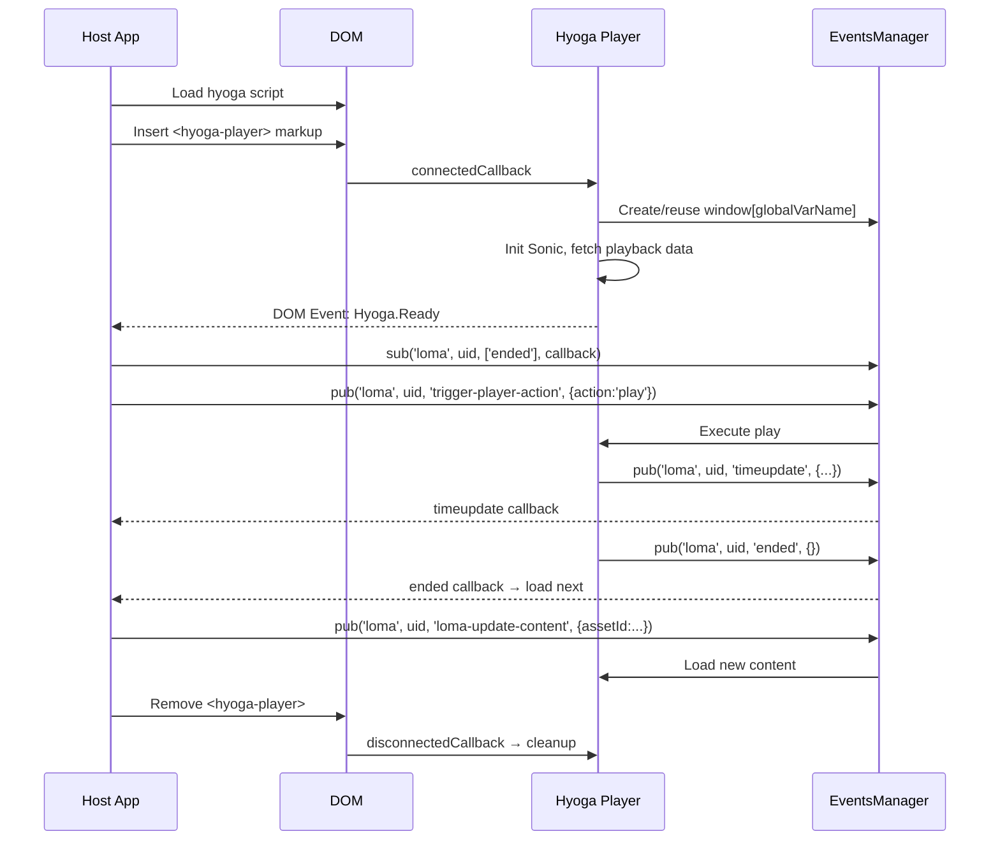

# Integration

This guide covers how to integrate Hyoga into a host application, with a focus on the HbbTV platform. 
The `hbbtv-videoplayer-bundle` is used throughout as a real-world reference implementation.

---

## Loading Hyoga

Before mounting any player element, the Hyoga library script must be loaded into the page. On HbbTV this is typically done dynamically via a script loader:

```html
<script src="hyoga-web.min.js"></script>
```

### Pre-requisites (globals)

Before mounting `<hyoga-player>`, set up any required globals:

```js
// Video event trackers configuration (optional)
window.eventsVideoTrackers = [/* tracker configs */];

// Hyoga internal config (optional)
window._hyoga = { deviceUUID: '...' };

// Google Analytics dataLayer (optional)
window.dataLayer = window.dataLayer || [];
```

---

## DOM Setup

Hyoga is a set of **Web Components**. The player is created by inserting `<hyoga-player>` markup into the DOM. This is the core integration point — every attribute maps to a Hyoga configuration option.

### VOD Player

```html
<hyoga-player
  id="hyogaManager-player-uuid-0"
  uid="player-uuid-0"
  globaleventsmanager="uuid-0@lomaEventsManager"
  hyogamanager="hyogaManager-player-uuid-0"
  playerselector="hyogaPlayer-player-uuid-0"
  videolibrary="videojs"
  sourcetype="sonic"
  endpoint="https://public.aurora.enhanced.live"
  realm="it"
  assetid="23799"
  playbacktype="video"
  autoplay="true"
  muted="true"
>
  <hyoga-videoplayer hyogamanager="hyogaManager001" />
</hyoga-player>
```

### Live / Channel Player

```html
<hyoga-player
  id="hyogaManager-player-uuid-0"
  uid="player-uuid-0"
  playerselector="hyogaPlayer-player-uuid-0"
  videolibrary="videojs"
  sourcetype="sonic"
  globaleventsmanager="uuid-0@lomaEventsManager"
  hyogamanager="hyogaManager-player-uuid-0"
  disableobserver="false"
  endpoint="https://stage-public.aurora.enhanced.live"
  realm="it"
  assetid="6"
  sourceparams="aws.manifestsettings=start:1740997225"
  playbacktype="channel"
  autoplay="true"
  muted="true"
>
  <hyoga-videoplayer hyogamanager="hyogaManagerLive" />
</hyoga-player>
```

### Attribute Reference

:::tip
The full attribute API reference with detailed descriptions is also available in the [API documentation](api#hyoga-player-attributes).
:::

#### Core Attributes

| Attribute | Required | Default | Description |
|-----------|----------|---------|-------------|
| `id` | yes | — | Unique Hyoga manager identifier |
| `uid` | yes | — | Player UID, used as key in the EventsManager |
| `globaleventsmanager` | yes | — | Format `<uid>@<globalVarName>` — creates/reuses `window[globalVarName]` |
| `playerselector` | no | `hyogaPlayer-<uid>` | CSS selector for the inner video element |
| `videolibrary` | no | `videojs` | Underlying player engine: `dashjs`, `hlsjs`, or `videojs` |
| `sourcetype` | no | `sonic` | Content source type: `sonic` or `direct` |
| `playbacktype` | no | `video` | `video` or `channel` |

#### Sonic Source Attributes

These attributes apply when `sourcetype="sonic"` (default).

| Attribute | Required | Default | Description |
|-----------|----------|---------|-------------|
| `endpoint` | yes | — | Sonic API endpoint URL |
| `realm` | yes | — | Sonic realm |
| `assetid` | yes | — | Sonic video/channel ID (also accepted via URL query param) |
| `clientid` | no | `WEB:UNKNOWN:wbdatv:2.1.9` | Client identifier passed to Sonic |
| `discoparams` | no | `''` | Extra parameters passed to Sonic |
| `token` | no | — | Initial authentication token for Sonic |

#### Direct Source Attributes

These attributes apply when `sourcetype="direct"`.

| Attribute | Required | Default | Description |
|-----------|----------|---------|-------------|
| `src` | yes | — | Direct video source URL |
| `srctype` | yes | — | Stream type for the direct source (e.g. `dash`, `hls`) |
| `title` | no | — | Video title |
| `description` | no | — | Video description |
| `poster` | no | — | Poster image URL |

#### Playback Options

| Attribute | Required | Default | Description |
|-----------|----------|---------|-------------|
| `streamtype` | no | — | Stream format hint (`dash`, `hls`). Auto-detected from `videolibrary` if omitted |
| `autoplay` | no | `false` | Auto-start playback (`true`/`false`) |
| `muted` | no | `false` | Start muted (`true`/`false`) |
| `controls` | no | `true` | Show native Hyoga controls (`true`/`false`) |
| `position` | no | — | Start position in milliseconds |
| `startover` | no | — | Enable start-over for live streams (`true`/`false`) (HbbTV only) |
| `sourceparams` | no | — | Custom query params appended to the playback URL (HbbTV only) |
| `disableobserver` | no | `false` | Disable IntersectionObserver-based pause/resume (`true`/`false`) |
| `disablepip` | no | `false` | Disable Picture-in-Picture (`true`/`false`) |
| `representationsMax` | no | — | Maximum number of video representations |
| `representationsMin` | no | — | Minimum number of video representations |

#### UI Options

| Attribute | Required | Default | Description |
|-----------|----------|---------|-------------|
| `hideoverlay` | no | `false` | Hide the default Hyoga overlay (`true`/`false`) |
| `locale` | no | `en` | Language code for UI strings |

#### Advertising

| Attribute | Required | Default | Description |
|-----------|----------|---------|-------------|
| `adsystem` | no | `fw` | Ad system: `fw` (FreeWheel) or `ima` (Google IMA) |
| `adtagurl` | no | — | Ad tag URL (used with `adsystem="ima"`) |
| `deferredadinit` | no | `false` | Defer ad request until user interaction (`true`/`false`) |

#### Content Filtering

| Attribute | Required | Default | Description |
|-----------|----------|---------|-------------|
| `maxagerating` | no | — | Maximum age rating for filtering content |

---

## Player Lifecycle

### 1. Mount

Insert the `<hyoga-player>` markup into the DOM. Hyoga's `connectedCallback` fires automatically and:

1. Creates an internal `EventsManager` for the player's own events
2. Parses the `globaleventsmanager` attribute and creates/reuses `window[globalVarName]`
3. Initializes the Stone client to fetch playback data
4. Dispatches a `Hyoga.Ready` DOM event when the player is fully initialized

```js
// Example: dynamically mount a player
const container = document.getElementById('player-root');
container.innerHTML = hyogaMarkup; // your <hyoga-player> HTML string

// Wait for Hyoga to be ready
document.addEventListener('Hyoga.Ready', () => {
  // window.myEventsManager is now available
  console.log('Player ready');
}, { once: true });
```

### 2. Control via EventsManager

Once `Hyoga.Ready` fires, the global EventsManager is available. See the [API documentation](api#eventsmanager) for full details on [`sub()`](api#subcategory-playerid-events-callback), [`pub()`](api#pubcategory-playerid-event-data), and [`destroy()`](api#destroyplayerid-eventcategories).

#### Play / Pause

```js
const EM = window.myEventsManager;
const uid = '001';

// Start playback
EM.pub('loma', uid, 'trigger-player-action', { action: 'play' });

// Pause
EM.pub('loma', uid, 'trigger-player-action', { action: 'pause' });
```

#### Seek

```js
// Fast-forward 30 seconds
EM.pub('loma', uid, 'trigger-player-action', {
  action: 'ffw', timeDelta: 30, forcePlay: true
});

// Rewind 10 seconds
EM.pub('loma', uid, 'trigger-player-action', {
  action: 'rwd', timeDelta: 10, forcePlay: true
});

// Restart from beginning
EM.pub('loma', uid, 'trigger-player-action', {
  action: 'restart', forcePlay: true
});

// Jump to live edge (live streams only)
EM.pub('loma', uid, 'trigger-player-action', { action: 'seekLiveEdge' });
```

#### Switch Content Without Remounting

Load a different video into the same player instance:

```js
EM.pub('loma', uid, 'loma-update-content', {
  endpoint: 'https://sonic.example.com/content/videos',
  realm: 'dmax',
  playbackType: 'video',
  assetId: 'new-video-id',
  forcePlay: true
});
```

#### Listen to Player Events

```js
// React to video end (e.g. autoplay next in playlist)
EM.sub('loma', uid, ['ended'], (event, data) => {
  loadNextVideo();
});

// Hide a custom loading spinner on first playback data
EM.sub('loma', uid, ['timeupdate', 'ads-timeupdate'], (event, data) => {
  hideSpinner();
});

// Track ad lifecycle
EM.sub('loma', uid, ['ads-ad-started', 'ads-ad-ended'], (event, data) => {
  console.log(event, data);
});

// Detect content source loaded (includes metadata)
EM.sub('video', uid, ['sourceloaded'], (event, data) => {
  console.log('Content metadata:', data.content);
});
```

### 3. Unmount

Remove the `<hyoga-player>` element from the DOM. Hyoga's `disconnectedCallback` automatically cleans up internal subscriptions. The host application should also clean up its own event listeners:

```js
// Remove listeners
document.removeEventListener('Hyoga.Ready', onReady);

// Remove the player from DOM
document.getElementById('player-root').innerHTML = '';
```

---

## HbbTV Integration Example

The `hbbtv-videoplayer-bundle` wraps Hyoga for HbbTV with remote control handling, custom overlay, and device resource management. Below is a simplified integration flow.

### Initialization

```js
// The bundle exposes: launch, execute, newProgram
hbbtvVideoPlayer.launch({
  hook: containerHook,  // HbbTV app SDK reference
  url: configUrl        // Remote JSON config URL
});
```

The `launch` function loads the Hyoga script, sets up trackers/ads configuration, and emits `videoplayer.ready` on the host event bus.

### Loading a Video

```js
hbbtvVideoPlayer.execute({
  action: 'load',
  requestResource: true,
  params: {
    id: 'my-video-uid',
    live: false,
    assetId: 'sonic-video-id',
    playbackType: 'video',
    endpoint: 'https://sonic.example.com/content/videos',
    realm: 'dmax',
    clientId: 'HBBTV:APP:wbdatv:2.1.9',
    locale: 'en',
    videoLibrary: 'dashjs',
    sourceType: 'sonic',
    streamType: 'dash',
    adsystem: 'fw',
    autoplay: 'true',
    muted: 'false',
    videoIds: ['id1', 'id2', 'id3'],   // playlist for next/prev
    overlayData: { /* show name, logo, description, ratings... */ },
    backPlayer: () => { /* on-close callback */ }
  }
});
```

Internally, the bundle:
1. Builds the `<hyoga-player>` markup from the params using a template
2. Injects it into the DOM
3. Listens for `Hyoga.Ready`
4. Subscribes to `timeupdate` / `ads-timeupdate` via the EventsManager to hide the loading spinner
5. Sets up remote control key handlers that map to EventsManager commands

### How the Bundle Uses the EventsManager

```js
// On Hyoga.Ready — subscribe to events for UI updates
window.globalEventsManager.sub('loma', videoId,
  ['timeupdate', 'ads-timeupdate'],
  (event, data) => { hideLoadingSpinner(); }
);

// Remote control → play
window.globalEventsManager.pub('loma', videoId,
  'trigger-player-action', { action: 'play' }
);

// Remote control → seek forward with acceleration
window.globalEventsManager.pub('loma', videoId,
  'trigger-player-action', { action: 'ffw', timeDelta: 30, forcePlay: true }
);

// Playlist: switch to next video
window.globalEventsManager.pub('loma', videoId,
  'loma-update-content', {
    endpoint: endpointUrl,
    realm: realm,
    playbackType: 'video',
    assetId: nextVideoId,
    forcePlay: true
  }
);
```

### Teardown

```js
// Hide player (keeps DOM)
hbbtvVideoPlayer.execute({ action: 'dispose', requestResource: true });

// Fully remove player (destroys DOM)
hbbtvVideoPlayer.execute({ action: 'destroy', requestResource: true });
```

The bundle cleanup removes DOM event listeners (`Hyoga.Ready`, `keydown`, `keyup`), uninitializes Spatial Navigation, releases hardware resources (remote controller, video decoder), and restores broadcast video.

---

## Lifecycle Diagram



---

## Key Points

- **`window[globalVarName]` is only available after a `<hyoga-player>` element with the `globaleventsmanager` attribute has been connected to the DOM.** Before that, the variable is `undefined`.
- The `uid` in the `globaleventsmanager` attribute is the addressing key — all `pub`/`sub` calls must use the same `uid` to target a specific player.
- Multiple player instances can share the same global EventsManager variable; each is identified by its unique `uid`.
- Hyoga's built-in overlay and controls can be disabled (`hideoverlay="true"`, `controls="false"`) to allow the host application to provide its own UI — this is the typical approach on HbbTV.
- The `Hyoga.Ready` DOM event is the safe point to start interacting with the EventsManager.
