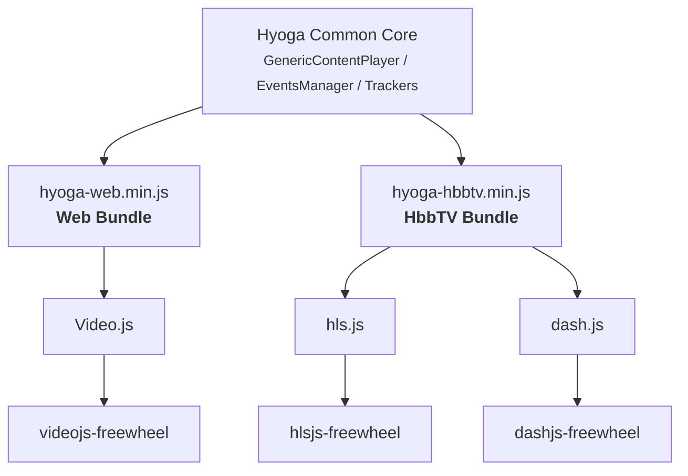

# Introduction

## Current project scope
- Web player (Chrome, Safari, Firefox, Edge) for mobile and desktop
- [HbbTV](https://developer.hbbtv.org/guide/introduction/) player for smart TVs 
    - [HTML5 Video Element](https://developer.mozilla.org/en-US/docs/Web/HTML/Reference/Elements/video) + [dash.js](https://github.com/dash-industry-forum/dash.js/)
    - [HTML5 Video Element](https://developer.mozilla.org/en-US/docs/Web/HTML/Reference/Elements/video) + [hls.js](https://github.com/video-dev/hls.js/)

## Available features
- Standard playback features (play, pause, seek, fullscreen, etc)
- Continuous playing (start video content from a specific point)
- Subtitles and multiaudio
- DASH & HLS playback
- DRM over DASH & HLS (Widevine, Playready, Fairplay) with custom authentication headers
- Publisher/Subscriber Events Manager
- StoneJS integration (Javascript SDK exposing Sonic API)
- Player overlays system
- Player customization with CSS overriding
- Trackers integration 